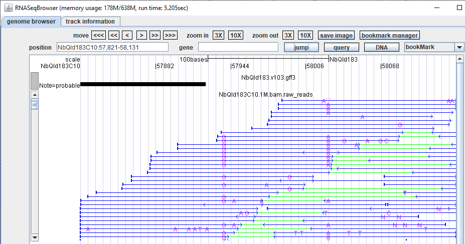

# Variant Calling: Variant Calling from RNA-seq Data

Induced mutagenesis is commonly used for the discovery of genetic variation and new allelic variants (Chaudhary et al., 2019). This tool is employed to detect variants in forward genetic screens and transgenic organisms from RNA-seq data. Unlike most mapping-by-sequencing strategies, this tool accepts standard mapping data format (BAM) and generates text for all homozygous and heterozygous variants, including SNPs and InDels. 
The BAM file can be visualized in RNA-seq Browser:

## quick start
1. run VariantCalling
    1. clone code (in windows terminal CMD or linux terminal) using 
    ```console
       >git clone https://github.com/anjiyuan/variant.git
    ```
    2. **Linux or MacOs:** 1. goto demoData filder 2. bash variant.sh
    3. **windows:** 1. goto demoData filder 2. double click variant.bat


